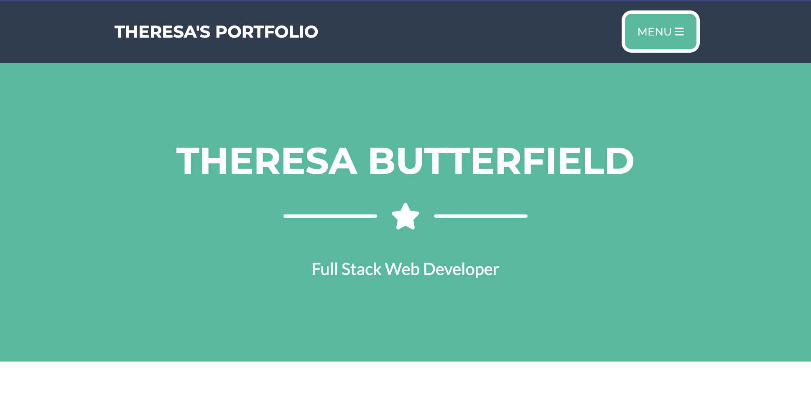
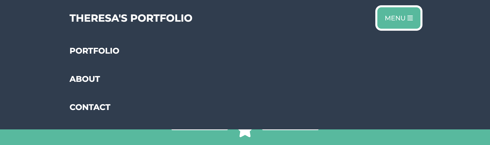

# Theresa's Portfolio

## Purpose
This is a website to showcase all of my projects that I have worked on while also telling a little bit about myself and how you can reach me!

## User Story

```
AS AN employer
I WANT to view a potential employee's deployed portfolio of work samples
SO THAT I can review samples of their work and assess whether they're a good candidate for an open position
```

## Acceptance Criteria

```
GIVEN I need to sample a potential employee's previous work
WHEN I load their portfolio
THEN I am presented with the developer's name, a recent photo or avatar, and links to sections about them, their work, and how to contact them
WHEN I click one of the links in the navigation
THEN the UI scrolls to the corresponding section
WHEN I click on the link to the section about their work
THEN the UI scrolls to a section with titled images of the developer's applications
WHEN I am presented with the developer's first application
THEN that application's image should be larger in size than the others
WHEN I click on the images of the applications
THEN I am taken to that deployed application
WHEN I resize the page or view the site on various screens and devices
THEN I am presented with a responsive layout that adapts to my viewport
```

## Built With:
* HTML
* CSS

## Website
https://theresa2013.github.io/theresa-portfolio/ 

## GitHub
https://github.com/Theresa2013/theresa-portfolio.git 

## Screenshots



Contribution
Made by Theresa Butterfield